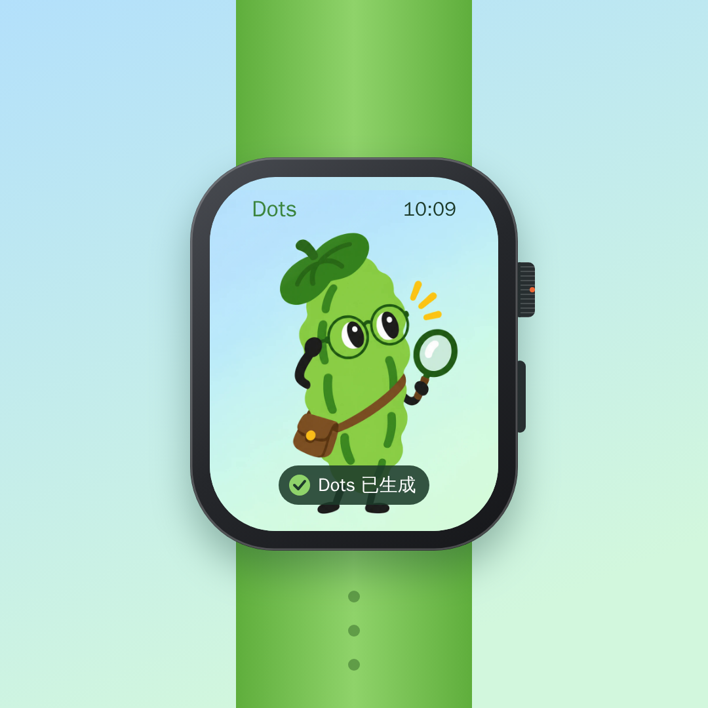

# Dots on Apple Watch

一块 Apple Watch 上的 Dots 动画：蜂窝状的圆点从中心一圈圈亮起，中间的 icon 是黄瓜侦探（`assets/cucumber.png`）。转动表冠滚动网格后，点开中间的 icon，屏幕显示“Dots 已生成”。

全部在本地运行，不依赖任何在线视频生成服务。



成品视频：[`media/dots-applewatch.mp4`](media/dots-applewatch.mp4)（1080×1080，30fps，9 秒）

## 本地运行

需要 Node.js 18+；导出视频还需要 `ffmpeg`（macOS：`brew install ffmpeg`）。

```bash
npm install
npx playwright install chromium   # 只在第一次导出视频前需要

npm start          # 实时预览：打开 http://127.0.0.1:5173/
npm run render     # 导出 media/dots-applewatch.mp4 和 media/poster.png
```

- 预览页面加 `?t=3.5` 可以定格在第 3.5 秒。
- 导出参数：`npm run render -- --fps 60 --out media/dots-60fps.mp4`

## 结构

| 文件 | 作用 |
| --- | --- |
| `src/dots.js` | 全部绘制逻辑。`render(t)` 给定时间画出一帧，实时预览和导出共用 |
| `index.html` | 预览页面 |
| `scripts/serve.mjs` | 本地静态服务器（Canvas 读像素需要走 http） |
| `scripts/render-video.mjs` | 用无头 Chromium 逐帧截取 Canvas，再交给 ffmpeg 编码 |
| `assets/cucumber.png` | 中间的 icon |

想换中间的 icon，替换 `assets/cucumber.png` 后重新 `npm run render` 即可。时间轴（各段的起止秒数）在 `src/dots.js` 的 `drawScreen` 和 `panOffset` 里。
